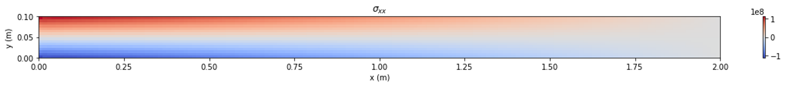

<!-- This page is for temporary website -->

# Python Finite Volume Solid Mechanics 

Host [website](https://scottlevie97.github.io/pythonFVSolidMechanics/) for finite volume solid mechanics eductional framework by Scott Levie. 

This learning framework is a set of Jupyter notebooks that provide an guide for building a Finite Volume Solid Mechanics solver while giving an in-depth explanation of the theory used through-out.  

## Characteristics of the Solver

- Linear elastic solids
- Segregated solution algorithm
- Structured mesh for rectangular geometry
- Fixed displacement or traction boundary conditions

## Where to start? 

To only view the notebooks use the following links to the desired notebooks. Then use the navigation arrows to move from notebook to notebook.

### List of notebooks:

- [Notebook 1: Defining Mesh](https://nbviewer.org/github/scottlevie97/pythonFVSolidMechanics/blob/new-release/lesson_notebooks/_01_Defining_Mesh.ipynb?flush_cache=true)
- [Notebook 2: Derivation & Discretisation](https://nbviewer.org/github/scottlevie97/pythonFVSolidMechanics/blob/new-release/lesson_notebooks/_02_Derivation_Discretistion.ipynb?flush_cache=true)
- [Notebook 3: Internal Cells](https://nbviewer.org/github/scottlevie97/pythonFVSolidMechanics/blob/new-release/lesson_notebooks/_03_Internal_Cells.ipynb?flush_cache=true)
- [Notebook 4: Fixed Displacement BCs](https://nbviewer.org/github/scottlevie97/pythonFVSolidMechanics/blob/new-release/lesson_notebooks/_04_Fixed_Displacement_BCs.ipynb?flush_cache=true)
- [Notebook 5: Fixed Traction BCs](https://nbviewer.org/github/scottlevie97/pythonFVSolidMechanics/blob/new-release/lesson_notebooks/_05_Fixed_Traction_BCs.ipynb?flush_cache=true)
- [Notebook 6: Solution Algorithm](https://nbviewer.org/github/scottlevie97/pythonFVSolidMechanics/blob/new-release/lesson_notebooks/_06_Solution_Algorithm.ipynb?flush_cache=true)
- [Notebook 7: Time Loop](https://nbviewer.org/github/scottlevie97/pythonFVSolidMechanics/blob/new-release/lesson_notebooks/_07_Time_Loop.ipynb?flush_cache=true)
- [Notebook 8: Post-Processing](https://nbviewer.org/github/scottlevie97/pythonFVSolidMechanics/blob/new-release/lesson_notebooks/_08_Post-Processing.ipynb?flush_cache=true)

If you want to be able to codealong or alter the notebooks try using the binder link below. This creates an online Jupyter notebook environment:

This may take a few minutes to load. Once loaded:

1. Use <code>ctrl</code> + <code>shift</code> + <code>f</code> to open the file browser. Or select the </img> icon in the top left corner.
2. Open the <code>dependincies.ipynb</code> notebook and run the first cell by selecting the run cell icon </img>. This loads the necessary packages within the environment.
3. Begin with notebook 1: <code>_01_Defining_Mesh.ipynb</code> and continue through to notebook 8.

Alternatively you can clone this repository from the [Github repo](https://github.com/scottlevie97/pythonFVSolidMechanics).

You will need python3 and jupyter installed.

Before using these notebooks install the necessary dependencies by running the lesson_notebooks/Dependencies.ipynb notebook.

## Acknowledgements 

Financial support is gratefully acknowledged from the Irish Research Council through the Laureate programme, grant number IRCLA/2017/45

Additionally, the authors want to acknowledge project affiliates, Bekaert, through the Bekaert University Technology Centre (UTC) at UCD (www.ucd.ie/bekaert), and I-Form, funded by Science Foundation Ireland (SFI) Grant Number 16/RC/3872, co-funded under European Regional Development Fund and by I-Form industry partners.

