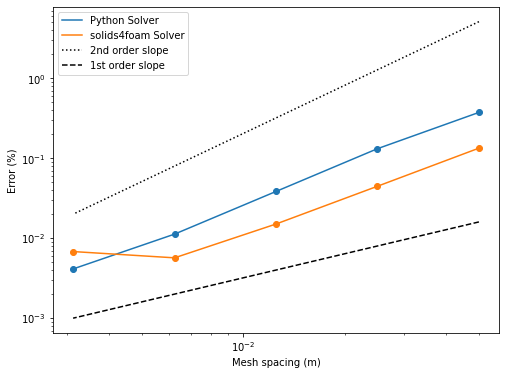

# Summary

This learning framework is a set of Jupyter notebooks that provide an in-depth explanation of each step required to build a working solid mechanics solver, these include: governing equations derivation; finite-difference and finite-volume discretisation of governing equations; implementation of fixed displacement and fixed traction boundary conditions; and segregated solution algorithm techniques. 

- Notebook 1: Introduction & Defining Geometry
- Notebook 2: Derivation and Discretisation of Governing Equations  
- Notebook 3: Internal Cells
- Notebook 4: Fixed Displacement Boundary Conditions
- Notebook 5: Fixed Traction Boundary Conditions
- Notebook 6: Solution Algorithm
- Notebook 7: Time Loop
- Notebook 8: Post Processing

The series the functions and classes created in each notebook form a 2-dimensional linear-elastic implicit segregated solid solver for a rectangular structured mesh, which is capable of applying either fixed displacement or fixed traction boundary conditions. The same functions and classes are also laid out in a separate directory to allow for an accessible solver for problem-solving capabilities.

# Statement of need

The Finite Volume (FV) method techniques for Computational Solid Mechanics (CSM) is an emerging alternative to the widely used (FE) method; in some cases, it has been shown to be faster than commercial FE software [1]. Solids4foam [2] is an open-source toolbox for solid mechanics and fluid-solid interactions that uses the FV framework within OpenFOAM, traditionally used for CFD. While solids4foam is a powerful tool for CSM it lacks certain accessibility, especially for those with limited computer science skills. The aim of this work is to provide an easily accessible open-source tool that requires little effort and time to run and can be used in both a problem solving and educational capacity.

# Validation of Solver

The accuracy and sensitivity of the solver formed by the Jupyter notebooks is compared to solids4foam in notebook 8:

# Acknowledgements

Financial support is gratefully acknowledged from the Irish Research Council (IRC) through the Laureate programme, grant number IRCLA/2017/45. Additionally, the authors want to acknowledge project affialiates, Bekaert, through the Bekaert University Technology Centre (UTC) at UCD (www.ucd.ie/bekaert), and I-Form, funded by Science Foundation Ireland (SFI) Grant Number 16/RC/3872, co-funded under European Regional Development Fund and by I-Form industry partners. 

# References